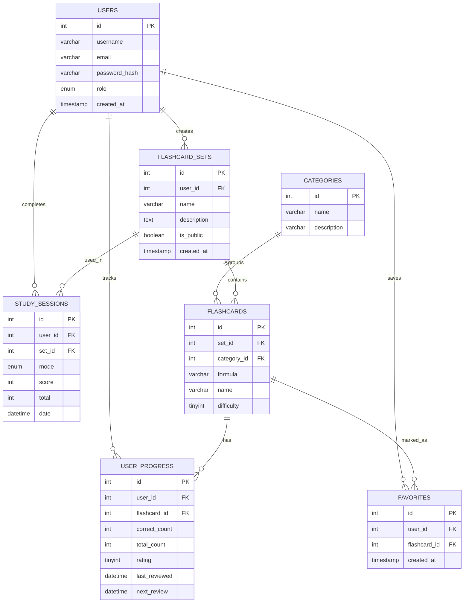

# Описание проекта

## Тема

**ChemCards: карточки для запоминания химических формул.**

Сайт предназначен для тренировки соответствия между химическими формулами и названиями веществ. Пользователь проходит карточки, вводит ответ, видит правильный вариант, а приложение сохраняет статистику и помогает повторять сложные карточки.

## Целевая аудитория

- школьники и студенты, изучающие базовую химию;
- преподаватели, которым нужен простой тренажёр для повторения формул;
- пользователи, которые хотят создавать собственные наборы веществ.

## Роли

| Роль | Возможности |
| --- | --- |
| Гость | Просмотр публичных наборов, демо-тренировка без сохранения прогресса |
| Пользователь | Полная тренировка, тесты, статистика, избранное, собственные наборы |
| Администратор | Управление глобальными наборами, карточками и пользователями |

## Функциональные требования

- регистрация и авторизация;
- разграничение прав по ролям;
- просмотр наборов и карточек;
- поиск по формуле или названию;
- фильтрация по категории;
- детальная страница карточки;
- CRUD для основной сущности через админку;
- создание пользовательских наборов;
- проверка ответа пользователя;
- учёт правильных и неправильных ответов;
- простой алгоритм повторения;
- история учебных сессий;
- график прогресса;
- избранные карточки.

## Нефункциональные требования

- работа в локальной среде OpenServer;
- хранение паролей через `password_hash()`;
- подключение к БД через PDO;
- защита форм CSRF-токенами;
- адаптивная вёрстка для мобильных и desktop-экранов;
- понятная структура проекта;
- SQL-скрипт для развёртывания БД.

## ER-схема

## Таблицы БД

| Таблица | Назначение |
| --- | --- |
| `users` | Аккаунты, email, хеш пароля, роль |
| `categories` | Категории веществ: оксиды, соли, кислоты и т.д. |
| `flashcard_sets` | Глобальные и пользовательские наборы |
| `flashcards` | Формула, название, категория, сложность |
| `user_progress` | Статистика пользователя по отдельной карточке |
| `study_sessions` | Итоги тренировок и тестов |
| `favorites` | Избранные карточки пользователя |

## Основная бизнес-логика

Ответ пользователя сравнивается с правильным названием после нормализации: удаляются пробелы и часть знаков препинания, строка приводится к нижнему регистру, `ё` заменяется на `е`.

Если ответ правильный, рейтинг карточки увеличивается, а дата следующего повторения переносится дальше. Если ответ неправильный, рейтинг уменьшается, карточка возвращается в очередь через 2-3 позиции.
